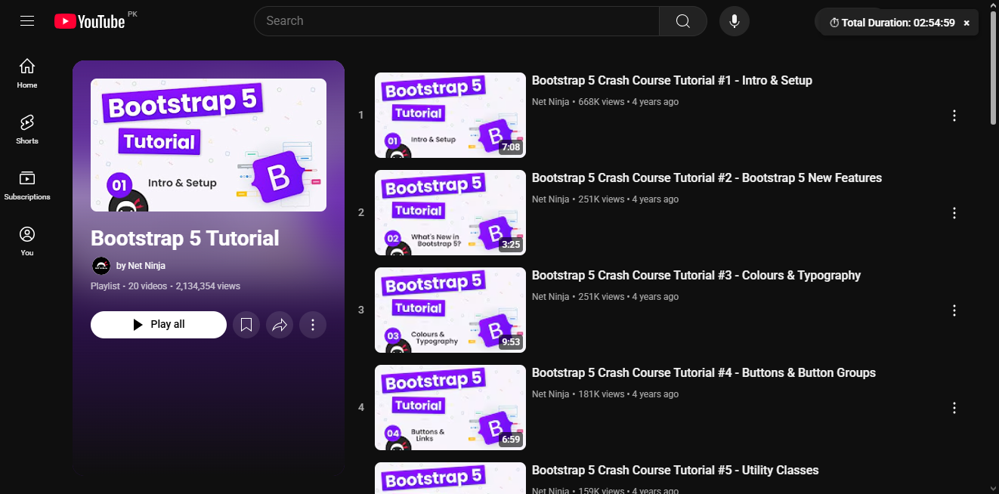

# YT-Playlist-Length

A simple browser extension for people who use YouTube to watch courses.
Displays total duration of any opened playlist at the top right corner of the page.

## Features

1. No Setup
2. No load - Consumes negligble amount of processing power
3. Auto-detect - Just open a playlist and it'll start the code.

### ⚠ Note about the API Key

Yes, the API key is visible — that’s because this is a 100% client-side project and hiding it is not technically possible.

However, using my key is pointless. It’s tied to strict usage limits, domain restrictions, and quotas. If you’re trying to actually use the extension or build on top of it, just create your own key — it’s free and takes two minutes on [Google Cloud Console](https://console.cloud.google.com/apis/credentials).